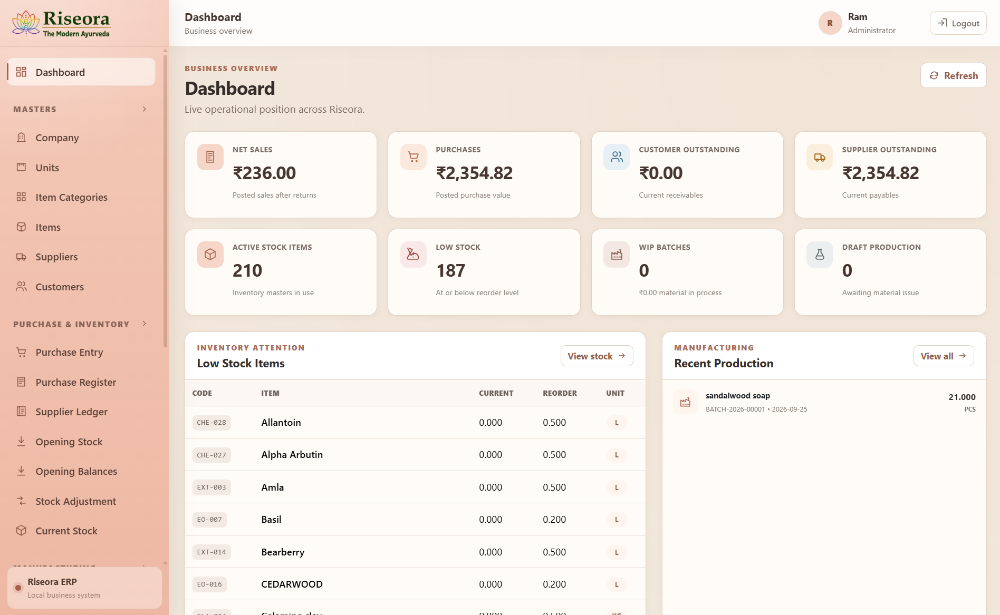

# Riseora ERP

> **Offline-first ERP for herbal and cosmetic manufacturing, inventory, production, sales, costing, and reporting.**

Riseora ERP is a Windows-focused business management system built for **Riseora Herbals**. It brings purchasing, stock control, formulation, production, costing, sales, invoicing, ledgers, and reporting into one local application designed for day-to-day use on a single business computer.

The application is designed to remain lightweight and practical for a small manufacturing business while preserving accurate inventory movements, production history, costing, and transaction records.

---

## ✨ Highlights

- Offline-first Windows desktop application
- Purchase and supplier management
- Customer and sales management
- Formula / recipe management
- Batch production planning and execution
- Planned vs actual material consumption
- One-off / unplanned production materials
- Production wastage, yield, rejection, rework, and scrap tracking
- Moving-average inventory costing
- Finished-goods costing
- Stock ledger and adjustments
- Customer and supplier outstanding ledgers
- GST-ready sales invoicing
- Professional A4 invoice printing / PDF
- Business reports and Excel exports
- Searchable ERP selectors
- PIN / City / State assistance for Indian addresses
- Email OTP password reset
- Manual and automatic SQLite backups
- Windows installer for non-technical users

---

## 🏭 Core Modules

### Masters

- Company Master
- Units
- Item Categories
- Items
- Suppliers
- Customers
- Opening Balances

### Purchase & Inventory

- Purchase Entry
- Supplier Payments
- Opening Stock
- Stock Adjustments
- Current Stock
- Stock Ledger
- Stock Valuation
- Reorder / Low Stock
- Lot and expiry tracking

### Formula Management

Riseora ERP supports reusable product formulas with:

- fixed-quantity formulas
- percentage-based formulas
- formula scaling
- ingredient quantities
- packaging components
- process allowance / extra ingredients
- formula history protection after production use

A standard formula represents the normal manufacturing recipe. Batch-specific differences are recorded in Production rather than silently changing the master formula.

### Production

Production supports the full planned-vs-actual workflow:

- production plan
- material requirements
- material issue
- actual material consumption
- unused quantity return
- extra consumption
- one-off / unplanned material consumption
- wastage
- good output
- rejected output
- rework
- scrap
- yield percentage
- labour cost
- utilities / electricity cost
- other manufacturing cost
- finished-goods unit cost
- QC
- completed-batch correction with audit history

#### Example

```text
Planned Output : 20 PCS
Actual Output  : 19 PCS
```

The ERP posts **19 PCS** to finished stock and records the production variance.

If a batch uses an item that is not part of the standard formula, the operator can use:

```text
+ Add Actual Material
```

That material is consumed only for the current production batch and does not modify Formula Master.

### Sales & Receivables

- Sales Invoice
- Customer Payments
- Partial payments
- Customer outstanding
- Customer ledger
- Credit notes / returns
- Refunds
- COGS and profitability
- GST calculations
- Printable A4 invoice

---

## 📊 Reports

Current reporting includes:

- Sales Register
- Purchase Register
- Production Register
- Current Stock
- Stock Valuation
- Stock Ledger
- Low Stock
- Expiry / Near Expiry
- Sales Profitability
- Customer Outstanding
- Customer Ledger
- Supplier Outstanding
- Supplier Ledger

Reports can be filtered and exported where applicable.

---

## 🧾 Invoice

Riseora ERP includes a professional A4 sales invoice layout with:

- company details
- customer details
- GST information
- invoice items
- taxable values
- GST totals
- amount paid
- balance due
- payment status
- bank / payment information
- amount in words
- terms
- company stamp / authorised signatory area
- Print / Save as PDF

---

## 🔐 Authentication & Password Reset

Riseora ERP includes:

- administrator login
- session-based authentication
- Forgot Password
- 6-digit email OTP
- OTP expiry
- resend cooldown
- attempt limit
- password replacement

SMTP credentials are configured locally and are **not committed to the repository or embedded in the installer**.

---

## 💾 Data Safety

Riseora ERP uses SQLite with WAL mode and keeps business data separate from the installed application.

### Installed Windows application

Business data is stored under the current Windows user's application-data folder:

```text
%APPDATA%\Riseora ERP\business-data\
```

Important locations:

```text
business-data\
├── data\
│   └── riseora_erp.db
├── backups\
├── desktop-config.json
└── logs\
```

The application supports:

- **Settings → Backup Now**
- automatic startup backups
- SQLite online backup
- integrity verification of manual backups
- persistent business data across normal application upgrades

> Never delete the `business-data` folder unless an intentional full data reset is required.

---

## 🖥️ Windows Desktop Application

Riseora ERP is packaged as an Electron desktop application.

The owner/user does **not** need:

- Node.js
- npm
- Vite
- a browser
- separate backend/frontend terminals

The Windows installer launches the frontend and backend internally.

Example release artifact:

```text
Riseora-ERP-Setup-1.0.0.exe
```

> The current trial installer may display an **Unknown Publisher / Windows SmartScreen** warning because it is not yet code-signed.

---

## 🛠️ Tech Stack

| Layer | Technology |
|---|---|
| Desktop | Electron |
| Frontend | React + Vite |
| UI | Bootstrap + custom CSS |
| Backend | Node.js + Express |
| Database | SQLite |
| SQLite Driver | `better-sqlite3` |
| Validation | Zod |
| Authentication | Express Session + bcrypt |
| Email / OTP | Nodemailer |
| India Location Data | `country-state-city-js` + postal lookup |
| Spreadsheet Export | ExcelJS |
| Packaging | electron-builder + NSIS |

---

## 🧱 Application Architecture

```text
┌──────────────────────────────┐
│        Riseora ERP           │
│      Electron Desktop        │
└──────────────┬───────────────┘
               │
               ▼
┌──────────────────────────────┐
│       React + Vite UI        │
└──────────────┬───────────────┘
               │ Local API
               ▼
┌──────────────────────────────┐
│     Node.js + Express API    │
│                              │
│  Business Rules / Services   │
└──────────────┬───────────────┘
               │
               ▼
┌──────────────────────────────┐
│ SQLite / better-sqlite3      │
│                              │
│ Stock • Cost • Production    │
│ Sales • Purchase • Ledgers   │
└──────────────────────────────┘
```

---

## 🔄 Business Flow

```text
Supplier
   │
   ▼
Purchase
   │
   ▼
Raw Material / Packaging Stock
   │
   ├───────────────┐
   │               │
   ▼               ▼
Formula       Inventory Cost
   │
   ▼
Production Plan
   │
   ▼
Material Issue
   │
   ▼
Actual Consumption
   │
   ▼
Production Output
   │
   ▼
Finished Goods Stock
   │
   ▼
Sales Invoice
   │
   ├──────────────► COGS / Profitability
   │
   ▼
Customer Ledger / Receivable
```

---

## 🚀 Development Setup

### Requirements

For source-code development:

- Windows 10/11 recommended
- Node.js
- npm
- Git

### Clone

```bash
git clone https://github.com/Manan0019/Riseora_ERP.git
cd Riseora_ERP
```

### Backend

```bash
cd server
npm install
npm run dev
```

Backend development URL:

```text
http://localhost:5000
```

### Frontend

Open another terminal:

```bash
cd client
npm install
npm run dev
```

Frontend development URL:

```text
http://localhost:5173
```

---

## 🖥️ Desktop Development

Install the desktop dependencies:

```bash
cd desktop
npm install
```

Run the desktop application using isolated development data:

```bash
npm start
```

Development desktop data is stored under:

```text
desktop\.dev-user-data\
```

This keeps desktop testing separate from the normal source-development database.

---

## 📦 Building the Windows Installer

From the project root:

```powershell
.\BUILD_RISEORA_INSTALLER.ps1
```

Expected output:

```text
desktop\release\Riseora-ERP-Setup-1.0.0.exe
```

The installer build intentionally excludes:

- development `.env`
- development SQLite database
- development desktop user data
- local secrets

---

## ⚙️ Environment Configuration

Create:

```text
server\.env
```

Example:

```dotenv
PORT=5000
NODE_ENV=development
CLIENT_ORIGIN=http://localhost:5173

SESSION_SECRET=replace-with-a-long-random-secret

INITIAL_ADMIN_USERNAME=ram
INITIAL_ADMIN_FULL_NAME=Ram
INITIAL_ADMIN_PASSWORD=replace-with-a-strong-password

SMTP_HOST=smtp.gmail.com
SMTP_PORT=587
SMTP_SECURE=false
SMTP_USER=
SMTP_PASS=
SMTP_FROM=

PASSWORD_RESET_OTP_MINUTES=10
PASSWORD_RESET_RESEND_SECONDS=60
PASSWORD_RESET_MAX_ATTEMPTS=5
```

### Important

Never commit:

```text
.env
*.db
*.sqlite
*.sqlite3
desktop/.dev-user-data/
```

Never commit SMTP passwords, Gmail App Passwords, session secrets, or real production business data.

---

## ✅ Testing

The project includes regression coverage for major business workflows.

Example:

```bash
cd server
npm run test:regression
```

Additional production-specific test scripts may also exist under:

```text
server/scripts/
```

Before producing a new owner release:

```text
1. Back up existing business data
2. Run regression tests
3. Test desktop startup
4. Test manual backup
5. Test purchase
6. Test production
7. Test sales
8. Test invoice printing
9. Test reports
10. Build and test the installer
```

---

## 🔒 Production Rules

A few important design rules:

- Posted business transactions should not be silently rewritten.
- Corrections should use correction / cancellation / credit-note / adjustment flows.
- Formula Master represents the standard recipe.
- Production actuals represent what really happened during a batch.
- Stock movements remain ledger-backed.
- Business data is stored outside the installed application.
- Back up before upgrades or structural database changes.

---

## 🗺️ Roadmap

Future improvements will be driven by real owner usage rather than adding unnecessary complexity.

Possible future work:

- enhanced backup/restore workflow
- scheduled external-drive/cloud-copy backup
- additional user roles and permissions
- FEFO/FIFO lot allocation improvements
- enhanced customer/supplier statements
- dashboard analytics
- invoice sharing
- digital code signing
- LAN / multi-PC deployment
- optional cloud deployment when required

---

## 📸 Screenshots

Screenshots can be added under:

```text
docs/screenshots/
```

Recommended screenshots:

- Login
- Dashboard
- Item Master
- Formula
- Production Work
- Sales Invoice
- A4 Invoice
- Reports

Example:

```markdown

```

---

## 📁 Repository Structure

```text
Riseora_ERP/
├── client/                 # React + Vite frontend
├── server/                 # Express API and SQLite business logic
├── desktop/                # Electron desktop wrapper / installer
├── data/                   # Local development database (ignored in Git)
├── docs/                   # Documentation / screenshots
├── BUILD_RISEORA_INSTALLER.ps1
└── README.md
```

---

## ⚠️ Disclaimer

This repository represents software built specifically around Riseora Herbals' internal business workflow.

Before using the system for another organisation, review and adapt:

- taxation rules
- invoice requirements
- inventory rules
- manufacturing workflow
- accounting treatment
- backup policy

---

## 📄 License

**Proprietary software — All Rights Reserved.**

The source code may be publicly visible for portfolio and development-reference purposes, but public repository visibility does not grant permission to copy, redistribute, sell, sublicense, or use this software commercially unless a separate license explicitly allows it.

---

## 👨‍💻 Developer

**Manan Bhayani**

Full-Stack / MERN Developer  
GitHub: [@Manan0019](https://github.com/Manan0019)

---

### Riseora ERP

**Simple local software for real manufacturing operations.**
