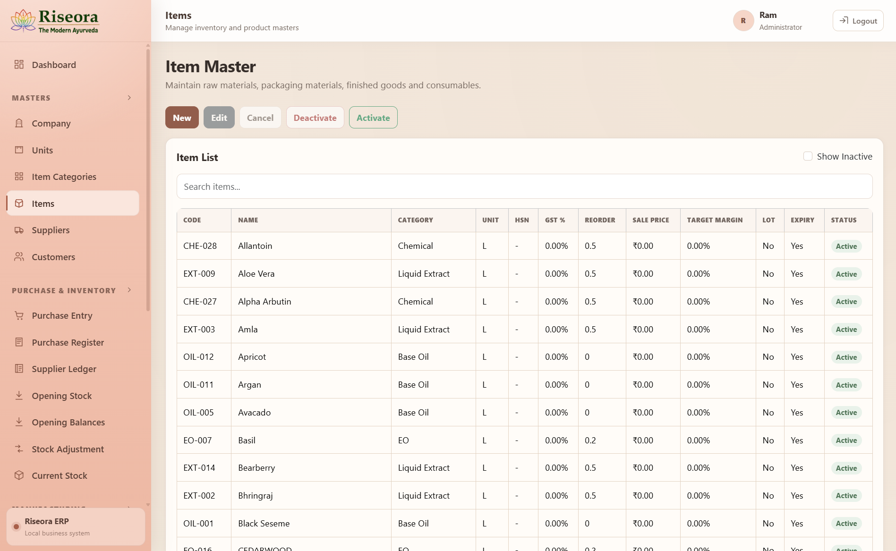
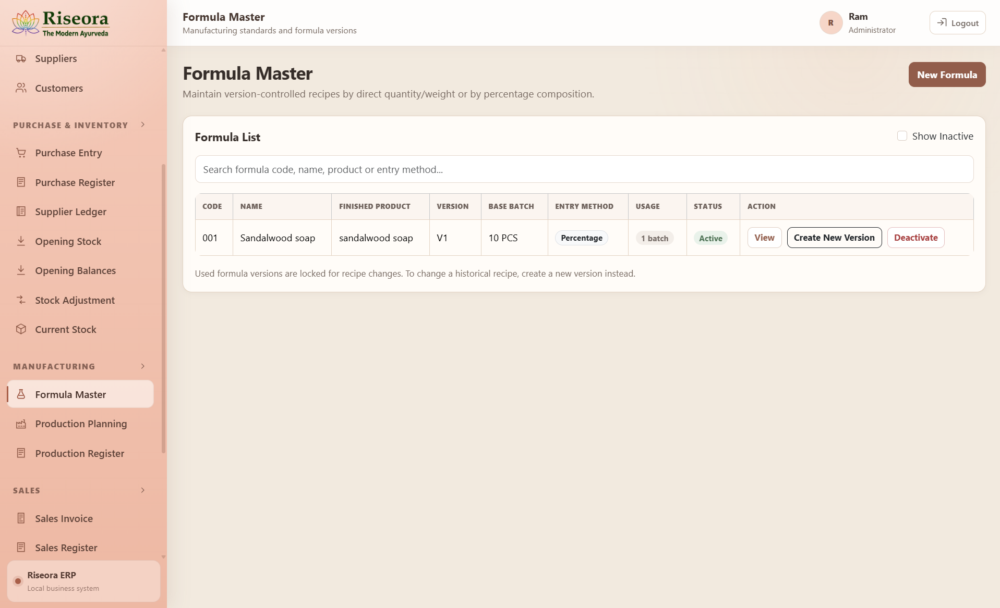
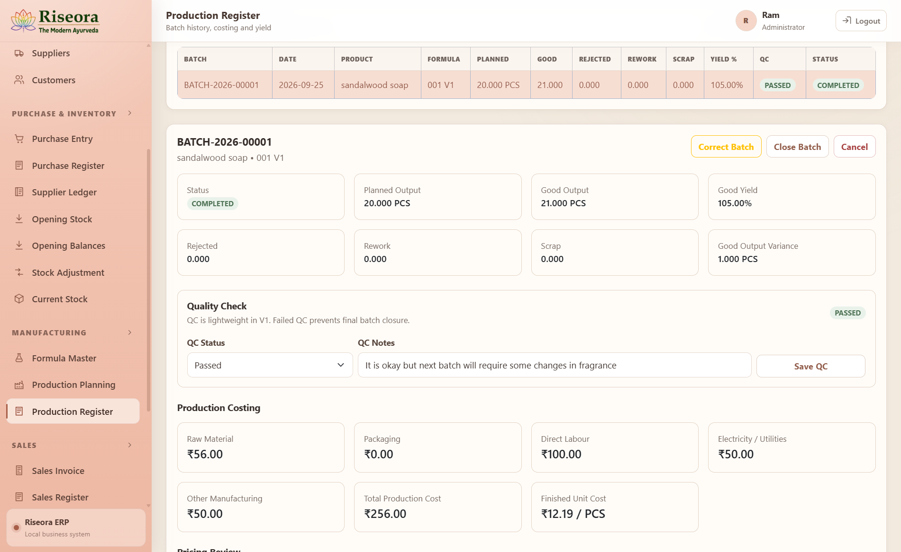
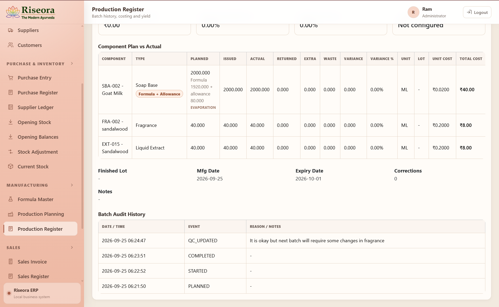
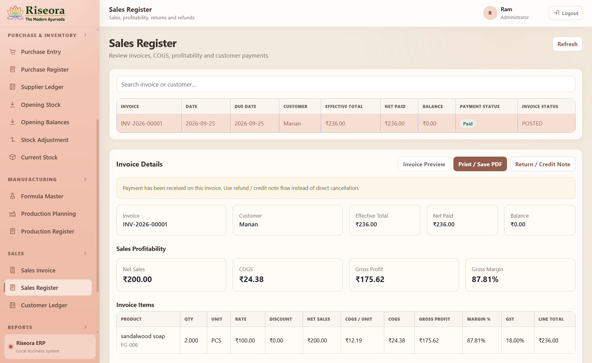
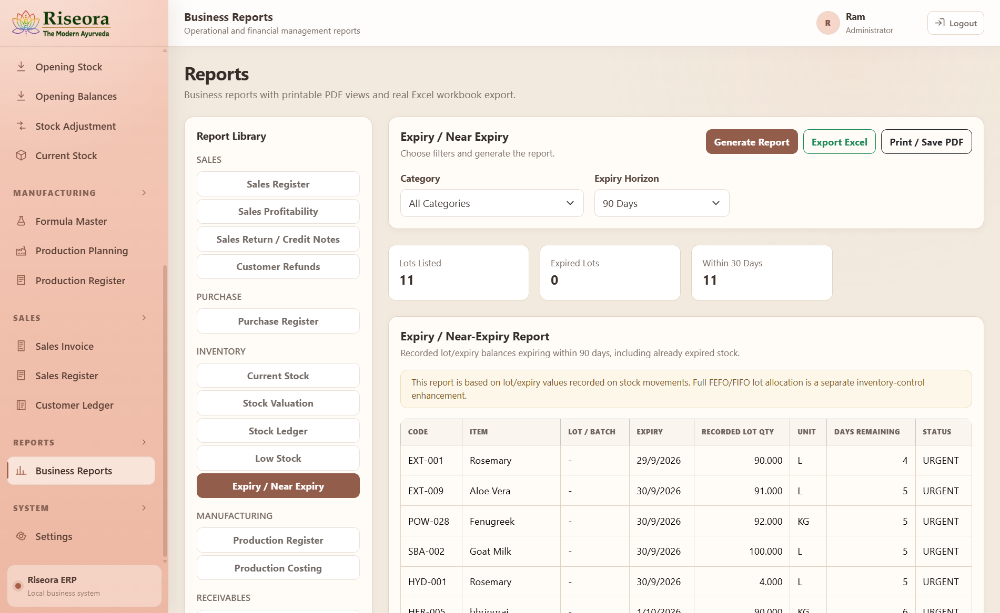
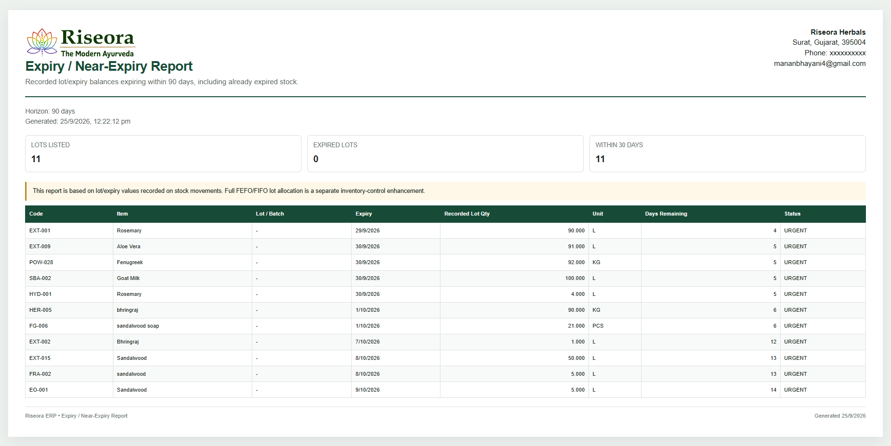
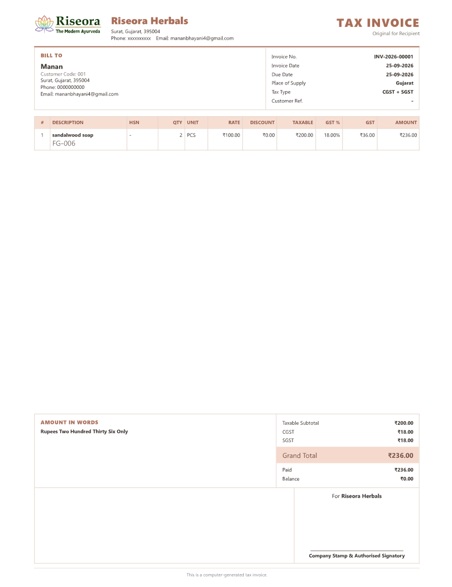
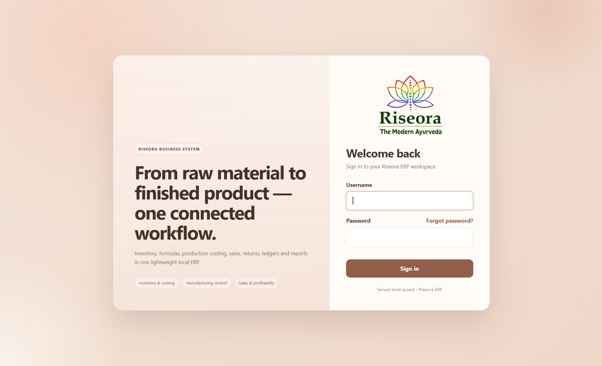

# Riseora ERP

> **Offline-first ERP for herbal and cosmetic manufacturing, inventory, production, sales, costing, and reporting.**

Riseora ERP is a Windows-focused business management system built for **Riseora Herbals**. It brings purchasing, inventory control, formulation, production, costing, sales, invoicing, ledgers, reporting, and backups into one local desktop application designed for day-to-day business use.

The project is built around a simple goal: keep the workflow practical for a small manufacturing business while preserving accurate stock movements, production history, costing, and financial records.

---

## 🎥 Product Demo

### Quick Demo

A short walkthrough covering the main Riseora ERP workflow.

[▶ **Watch the short Riseora ERP demo**](docs/media/riseora-erp-demo.mp4)

The demo includes:

- Login and dashboard
- Item and inventory management
- Formula management
- Production planning and execution
- Planned vs actual material consumption
- Production costing and yield
- Sales and profitability
- Business reports
- Database backup

### Full Product Walkthrough

For a detailed walkthrough of the complete Riseora ERP V1.0 workflow:

[▶ **Watch the Full Riseora ERP V1.0 Walkthrough**](https://github.com/Manan0019/Riseora_ERP/releases/tag/v1.0-demo)

> The full walkthrough is available as a downloadable video under the **Assets** section of the `v1.0-demo` release.

---

## 📸 Screenshots

### Dashboard

Live business overview covering sales, purchases, customer/supplier outstanding, inventory alerts, and recent production.


### Inventory & Item Master

Centralized management of raw materials, extracts, oils, packaging components, consumables, and finished goods.



### Formula Management

Version-controlled manufacturing formulas with percentage-based or direct-quantity composition.



### Production, Yield & Costing

Production batches preserve planned output, actual good output, rejected/rework/scrap quantities, QC status, yield, and manufacturing cost.



### Planned vs Actual Material Consumption

Track planned, issued, actual, returned, extra, and wasted material quantities together with cost and batch audit history.



### Sales & Profitability

Sales register with payment status, COGS, gross profit, margin analysis, returns, refunds, and invoice actions.



### Business Reports

Operational and financial reporting with filters, Excel export, and printable PDF views.



### Printable Expiry / Near-Expiry Report

Track recorded stock lots approaching expiry with days remaining, lot quantity, unit and urgency status.



### Professional A4 Tax Invoice

Printable GST-ready invoice with company/customer information, tax calculation, payment status, amount in words, and authorised signatory section.



### Secure Local Login



---

## ✨ Key Features

### Manufacturing

- Formula / recipe management
- Formula versioning
- Percentage-based and quantity-based formulations
- Formula scaling
- Production planning
- Material issue
- Planned vs actual consumption
- Returned material tracking
- Extra material consumption
- One-off / unplanned actual materials
- Process allowance
- Wastage
- Good output
- Rejected output
- Rework
- Scrap
- Yield calculation
- QC status and notes
- Production costing
- Batch corrections with audit history

### Purchase & Inventory

- Supplier master
- Purchase entry
- Supplier payments
- Opening stock
- Stock adjustments
- Current stock
- Stock ledger
- Stock valuation
- Reorder / low-stock monitoring
- Lot tracking
- Expiry tracking
- Weighted moving-average inventory costing

### Sales & Receivables

- Customer master
- Sales invoice
- Customer payments
- Partial payments
- Customer outstanding
- Customer ledger
- Sales returns / credit notes
- Refunds
- COGS calculation
- Sales profitability
- Gross margin analysis
- GST calculation
- A4 invoice print / Save as PDF

### Reports

- Sales Register
- Sales Profitability
- Sales Return / Credit Notes
- Customer Refunds
- Purchase Register
- Current Stock
- Stock Valuation
- Stock Ledger
- Low Stock
- Expiry / Near Expiry
- Production Register
- Production Costing
- Customer Outstanding
- Customer Ledger
- Supplier Outstanding
- Supplier Ledger

### Security & Reliability

- Administrator login
- Session-based authentication
- Forgot Password
- 6-digit email OTP
- OTP expiry and resend cooldown
- Password change
- Local SQLite database
- Manual database backup
- Automatic startup backups
- Backup history
- SQLite backup verification
- Business data stored separately from the installed program

---

## 🏭 Production Workflow

A standard formula represents the expected manufacturing recipe.

The production batch records what actually happened.

```text
Formula Master
      │
      ▼
Production Plan
      │
      ▼
Material Issue
      │
      ▼
Actual Consumption
      │
      ├── Returned Material
      ├── Extra Consumption
      ├── Waste
      └── One-Off / Unplanned Material
      │
      ▼
Production Output
      │
      ├── Good
      ├── Rejected
      ├── Rework
      └── Scrap
      │
      ▼
QC + Yield + Costing
      │
      ▼
Finished Goods Stock
```

For example:

```text
Planned Output : 20 PCS
Actual Output  : 19 PCS
```

The ERP records **19 PCS** as finished output and preserves the production variance.

If a material is used during a batch but is not part of the standard formula, the operator can add it as an **Actual / Unplanned Material** without changing Formula Master.

---

## 🔄 End-to-End Business Flow

```text
Supplier
   │
   ▼
Purchase
   │
   ▼
Raw Material / Packaging Stock
   │
   ├─────────────────────┐
   │                     │
   ▼                     ▼
Formula Master      Inventory Cost
   │
   ▼
Production Plan
   │
   ▼
Production Execution
   │
   ▼
Actual Consumption
   │
   ▼
Finished Goods Stock
   │
   ▼
Sales Invoice
   │
   ├──────────────► COGS / Profitability
   │
   ▼
Customer Ledger / Receivable
```

---

## 🧾 Invoice

Riseora ERP includes an A4 tax invoice designed for printing and PDF export.

It includes:

- Company details
- Customer details
- Invoice number and date
- Place of supply
- Tax type
- Item details
- HSN
- Quantity and unit
- Rate
- Discount
- Taxable value
- GST
- Grand total
- Paid amount
- Balance
- Amount in words
- Terms
- Company stamp / authorised signatory area

---

## 📊 Reporting

Reports are designed for operational use rather than static presentation only.

Depending on the report, the user can:

- apply filters
- review totals
- view detailed rows
- export to Excel
- print / save as PDF

The **Expiry / Near-Expiry** report helps identify recorded stock lots approaching expiry.

---

## 🖥️ Windows Desktop Application

Riseora ERP is packaged as an Electron desktop application.

The business owner does **not** need to install or run:

- Node.js
- npm
- Vite
- a browser
- separate frontend/backend terminals

A Windows installer can be generated as:

```text
Riseora-ERP-Setup-1.0.0.exe
```

The current unsigned trial installer may display a Windows **Unknown Publisher / SmartScreen** warning.

---

## 💾 Data Storage & Backups

The installed application keeps business data outside the installed program files.

Main application-data location:

```text
%APPDATA%\Riseora ERP\business-data\
```

Structure:

```text
business-data\
├── data\
│   └── riseora_erp.db
├── backups\
├── desktop-config.json
└── logs\
```

The application supports:

- **Settings → Backup Now**
- automatic startup backups
- backup history
- SQLite online backup
- integrity verification for generated backups

> Do not manually delete the `business-data` folder unless a full intentional reset is required.

---

## 🛠️ Tech Stack

| Layer | Technology |
|---|---|
| Desktop | Electron |
| Frontend | React + Vite |
| UI | Bootstrap + custom CSS |
| Backend | Node.js + Express |
| Database | SQLite |
| SQLite Driver | `better-sqlite3` |
| Validation | Zod |
| Authentication | Express Session + bcrypt |
| Email / OTP | Nodemailer |
| India Location Support | `country-state-city-js` + postal lookup |
| Windows Packaging | electron-builder + NSIS |

---

## 🧱 Architecture

```text
┌──────────────────────────────┐
│         Riseora ERP          │
│       Electron Desktop       │
└──────────────┬───────────────┘
               │
               ▼
┌──────────────────────────────┐
│       React + Vite UI        │
└──────────────┬───────────────┘
               │ Local HTTP API
               ▼
┌──────────────────────────────┐
│     Node.js + Express API    │
│                              │
│   Business Rules / Services  │
└──────────────┬───────────────┘
               │
               ▼
┌──────────────────────────────┐
│   SQLite / better-sqlite3    │
│                              │
│ Stock • Cost • Production    │
│ Sales • Purchase • Ledgers   │
└──────────────────────────────┘
```

The packaged backend is bound to the local machine only.

---

## 🚀 Development Setup

### Requirements

For source-code development:

- Windows 10 / 11 recommended
- Node.js
- npm
- Git

### Clone

```bash
git clone https://github.com/Manan0019/Riseora_ERP.git
cd Riseora_ERP
```

### Backend

```bash
cd server
npm install
npm run dev
```

Development API:

```text
http://localhost:5000
```

### Frontend

Open another terminal:

```bash
cd client
npm install
npm run dev
```

Development frontend:

```text
http://localhost:5173
```

---

## 🖥️ Desktop Development

Install desktop dependencies:

```bash
cd desktop
npm install
```

Run the Electron desktop build with isolated development data:

```bash
npm start
```

Desktop development data is stored under:

```text
desktop\.dev-user-data\
```

This keeps Electron testing separate from the normal project database.

---

## 📦 Build the Windows Installer

From the project root:

```powershell
.\BUILD_RISEORA_INSTALLER.ps1
```

Expected installer output:

```text
desktop\release\Riseora-ERP-Setup-1.0.0.exe
```

The installer build intentionally excludes:

- `server/.env`
- development SQLite databases
- `.dev-user-data`
- local session secrets
- SMTP credentials

---

## ⚙️ Environment Configuration

For local source development, create:

```text
server\.env
```

Example:

```dotenv
PORT=5000
NODE_ENV=development
CLIENT_ORIGIN=http://localhost:5173

SESSION_SECRET=replace-with-a-long-random-secret

INITIAL_ADMIN_USERNAME=ram
INITIAL_ADMIN_FULL_NAME=Ram
INITIAL_ADMIN_PASSWORD=replace-with-a-strong-password

SMTP_HOST=smtp.gmail.com
SMTP_PORT=587
SMTP_SECURE=false
SMTP_USER=
SMTP_PASS=
SMTP_FROM=

PASSWORD_RESET_OTP_MINUTES=10
PASSWORD_RESET_RESEND_SECONDS=60
PASSWORD_RESET_MAX_ATTEMPTS=5
```

Never commit real secrets.

---

## 🔐 Repository Safety

The following should remain excluded from Git:

```text
.env
*.db
*.sqlite
*.sqlite3
node_modules/
desktop/.dev-user-data/
desktop/release/
```

Do not commit:

- Gmail App Passwords
- SMTP passwords
- session secrets
- real customer/supplier private information
- live production databases
- database backups containing real business data

---

## ✅ Testing

Before producing a new owner release:

```text
1. Back up current business data
2. Run server regression tests
3. Test desktop startup
4. Test login
5. Test purchase
6. Test stock
7. Test formula management
8. Test production
9. Test production correction
10. Test sales
11. Test invoice Print / Save PDF
12. Test reports
13. Test Backup Now
14. Close and reopen the desktop app
15. Confirm business data persists
16. Build and test the Windows installer
```

Main regression command:

```bash
cd server
npm run test:regression
```

Additional workflow-specific verification scripts may be available under:

```text
server/scripts/
```

---

## 📁 Repository Structure

```text
Riseora_ERP/
├── client/                         # React + Vite frontend
├── server/                         # Express API + business logic
├── desktop/                        # Electron desktop wrapper / installer
├── docs/
│   ├── screenshots/
│   │   ├── login.png
│   │   ├── dashboard.png
│   │   ├── items.png
│   │   ├── formula-master.png
│   │   ├── production-register.png
│   │   ├── production-actuals.png
│   │   ├── sales-register.png
│   │   ├── business-reports.png
│   │   └── tax-invoice.png
│   └── media/
│       └── riseora-erp-demo.mp4
├── BUILD_RISEORA_INSTALLER.ps1
├── .gitignore
└── README.md
```

---

## 🗺️ Roadmap

Future development will be guided primarily by real owner usage.

Potential improvements include:

- Backup restore workflow
- Scheduled external-drive backup
- Optional cloud-synced backup
- Additional users and permissions
- Enhanced lot allocation
- FEFO / FIFO improvements
- Advanced customer/supplier statements
- Dashboard analytics
- Invoice sharing
- Windows code signing
- LAN / multi-PC deployment
- Optional cloud deployment

---

## ⚠️ Project Scope

Riseora ERP was designed specifically around **Riseora Herbals' internal business workflow**.

Before adapting it for another organisation, review:

- tax requirements
- invoicing rules
- manufacturing flow
- costing rules
- stock policies
- accounting treatment
- backup policy
- user-access requirements

---

## 📄 License

**Proprietary software. All rights reserved.**

This repository may be publicly visible for portfolio and development-reference purposes.

Public visibility does **not** grant permission to copy, redistribute, sell, sublicense, or commercially use the software unless a separate written license explicitly grants those rights.

---

## 👨‍💻 Developer

**Manan Bhayani**

Full-Stack / MERN Developer

GitHub: [@Manan0019](https://github.com/Manan0019)

---

<p align="center">
  <strong>Riseora ERP</strong><br>
  From raw material to finished product — one connected workflow.
</p>
